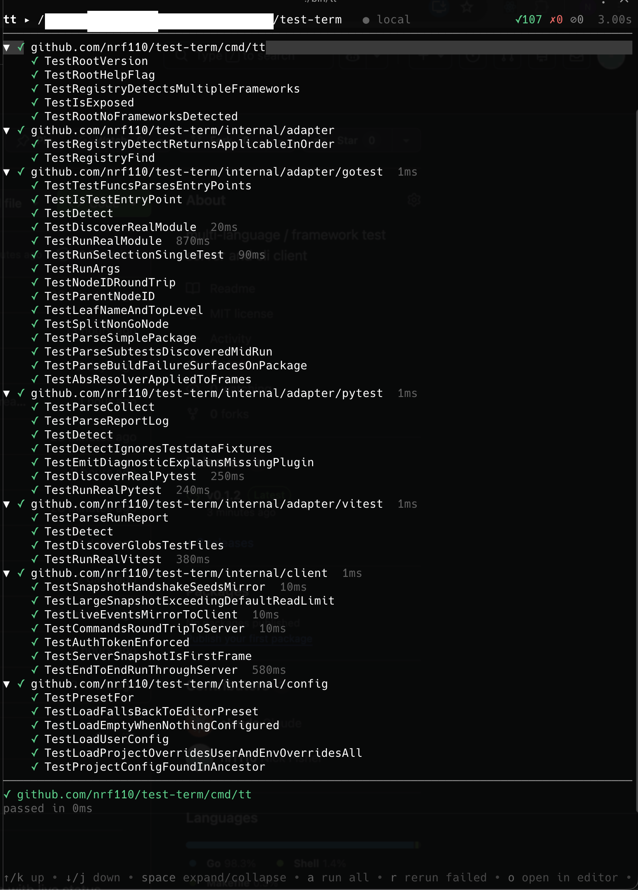

# tt

A terminal-UI test runner for polyglot projects.

`tt` auto-discovers tests across multiple language ecosystems, shows them in a
hierarchical tree with live status, and runs them locally or on a remote
machine. A single engine serves multiple observers — a local TUI, a remote TUI,
and AI agents over MCP all watch and drive the **same** test session.

<p align="center">
  
</p>

## Features

- **Multiple frameworks** in one view: Go (`go test`), **Vitest**, and **pytest**.
- **Tree view** suited to hierarchical BDD/spec suites (describe/it, classes,
  parametrized cases), with live pass/fail/skip status and roll-ups.
- **Headless engine**: run tests on a remote/sandboxed devbox and observe them
  locally — local and remote are the same code path.
- **MCP server**: an AI agent can trigger runs and read failures over MCP while
  your TUI watches the same live session.
- **Jump to failure**: open the failing test in your editor (configurable;
  works with Warp's clickable `file:line:col` too).

## Install

Homebrew (macOS and Linux):

```sh
brew install nrf110/tap/tt
```

With the Go toolchain:

```sh
go install github.com/nrf110/test-term/cmd/tt@latest
```

Or download a prebuilt binary from the [releases page](https://github.com/nrf110/test-term/releases).

## Usage

```sh
tt                 # discover + run tests in the current directory (TUI)
tt ./path/to/proj  # ...in a specific directory
tt serve           # headless engine for remote/agent access (loopback by default)
tt connect <addr>  # attach the TUI to a remote engine
```

Running `tt` discovers tests, opens the TUI, and auto-runs everything. The TUI
attaches to an in-process engine over a loopback socket — the exact same client
path used for remote engines.

### Keybindings

| Key | Action |
|-----|--------|
| `↑`/`k`, `↓`/`j` | move the cursor |
| `space` | expand / collapse a container |
| `→`/`l`, `←`/`h` | expand / collapse |
| `enter` | run the selected node |
| `a` | run all |
| `r` | rerun failed |
| `c` | cancel the running run |
| `o` | open the selected test in your editor |
| `/` | filter the tree |
| `?` | help |
| `q` | quit |

## Supported frameworks

| Ecosystem | Detection | Notes |
|-----------|-----------|-------|
| **Go** | `go.mod` | Uses `go test -json`; discovery via `go list` + AST. |
| **Vitest** | vitest config or `vitest` in `package.json` | Uses the JSON reporter; files discovered by glob, test cases populate on run. |
| **pytest** | `pytest.ini`/`conftest.py`/test files | Discovery via `--collect-only`; runs via the **`pytest-reportlog`** plugin. |

### pytest requires `pytest-reportlog`

The pytest adapter streams results via the
[`pytest-reportlog`](https://pypi.org/project/pytest-reportlog/) plugin, which
keeps node IDs consistent between discovery and execution:

```sh
pip install pytest-reportlog
```

If it's missing, `tt` shows a setup-error node explaining how to install it.

## Configuration

`tt` reads an optional TOML config from (later overrides earlier):

1. `~/.config/tt/config.toml` (or `$XDG_CONFIG_HOME/tt/config.toml`)
2. The nearest `.tt.toml` at or above the project directory
3. `$TT_EDITOR`
4. A preset derived from `$VISUAL` / `$EDITOR`

```toml
# editor command template; {file}, {line}, {col} are substituted
editor = "code -g {file}:{line}"
```

Presets are built in for VS Code/Cursor, vim/nvim, JetBrains IDEs, Emacs, Helix,
and more — so often just having `$EDITOR` set is enough.

## Remote / devbox

The engine executes arbitrary test code, so it binds **loopback only** by
default. To observe an agent running tests on a sandboxed devbox:

```sh
# on the devbox
tt serve                         # listens on 127.0.0.1:7878

# on your laptop
ssh -L 7878:127.0.0.1:7878 devbox
tt connect 127.0.0.1:7878
```

To bind a non-loopback address you **must** pass `--token <secret>`; clients then
authenticate with that bearer token. Prefer SSH tunneling over exposing a port.

## MCP

`tt serve` (and the local engine) expose an MCP endpoint at `/mcp` with tools:
`list_tests`, `run_tests`, `rerun_failed`, `get_results`, `get_failure`,
`cancel_run`. An agent's natural loop is `run_tests` → `get_results` →
`get_failure` → fix → `rerun_failed`, all visible live in a connected TUI.

## Contributing an adapter

An adapter is one Go package implementing four methods
([`internal/adapter`](internal/adapter/adapter.go)):

- `Detect(dir)` — does this framework apply here, and where is it rooted?
- `Discover(dir)` — list tests without running them (emit `NodeDiscovered`).
- `Run(dir, selection)` — execute and stream normalized events.
- `Locate(nodeID)` — map a node to a source location.

Everything an adapter emits is in the normalized event vocabulary
([`internal/event`](internal/event/event.go)); nothing else in the system knows
about a specific framework. See the Go, Vitest, and pytest adapters for
worked examples, each with golden-file parser tests.

## Development

```sh
make build   # build ./bin/tt
make test    # go test ./...
make lint    # go vet + golangci-lint
```

See the [design spec](docs/superpowers/specs/2026-06-10-tt-test-runner-design.md)
and [implementation plan](docs/superpowers/plans/2026-06-10-tt-implementation-plan.md).

## License

[MIT](LICENSE) © 2026 Nick Fisher
